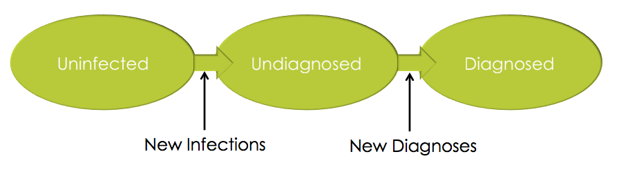

```{r setup, include = FALSE}
knitr::opts_chunk$set(
  collapse = TRUE,
  comment = "#>"
)
```


```{r, echo=FALSE}
library(knitr)
library(pander)
panderOptions('table.alignment.default', function(df) rep("left",ncol(df)))
```
## Introduction
HIV incidence is challenging to estimate, especially when only cross-sectional survey data is available, or the population of interest is hard to reach. Method utilizing recency assays require sample sizes in the tens of thousands and are sensitive to difficult to measure parameters such as the false recency rate and mean duration of recent infection.

The methods implemented in this package allow for the estimation of incidence from a single cross-sectional survey utilizing self-reported testing history. The basic idea is fairly intuitive. Individuals begin uninfected, and become infected at a certain rate. Those new infections start out undiagnosed and become diagnosed cases at a certain rate.


{ width=75% }

All things being equal:

* An increase in infection rate --> A larger undiagnosed population
* An increase in the diagnosis rate --> A smaller undiagnosed population

In fact, if we know the size of the undiagnosed population are the diagnosis rate (i.e. the expected time from infection to diagnosis ($E(TID)$)), then we also know the rate of infection. This is governed by the fundamental epidemic equation 
$$P(U) = rE(TID),$$
where $P(U)$ is the proportion undiagnosed and $r$ is the rate of infection.

In this package we assume that individuals become diagnosed either due to regular testing, or due to symptomatic progression to AIDS, whichever comes first. The rate at which individuals engage in testing and the distribution of time between tests is estimated from individuals' self-reported last HIV test.

The proportion undiagnosed $P(U)$ is estimated using the fraction of individuals reporting never having been diagnosed before. Due to the potential for miss-reporting, viral load and art biomarkers may be used to correct for miss-reporting using the rate of miss-reporting among those who are treated cases.

## Installing the Package

The development version of the package may be installed through github
```
# If devtools is not installed:
# install.packages("devtools")

devtools::install_github("fellstat/TestingHistoryIncidence", subdir="TestingHistoryIncidence")
```

## Basic Usage

We begin by loading a synthetic dataset included with the package.

```{r}
data(tstdat)

# Add age
tstdat$age <- rep(15:64, 200)

head(tstdat)
summary(tstdat)
```

This dataset has variables defines as:

* 'hiv' - HIV status
* 'ever_test' - Reported having ever had an HIV test.
* 'last_test' - number of months since last HIV test.
* 'undiag' - Actually has never been diagnosed with HIV in the past.
* 'report_pos' - Reports having a previous positive test.
* 'biomarker_art' - Tests positive for ART biomarkers.
* 'low_viral' - Is classified as having low (undetectable) viral load.
* 'age' - The age of the individual in years.

We can now estimate incidence using the `testing_incidence` function
```{r}
attach(tstdat)
inc <- testing_incidence(report_pos, biomarker_art, low_viral, hiv,
                                        ever_test, last_test)
#print(inc)
```
```{r, echo=FALSE, results="asis"}
#kable(inc)
pander(inc)
```

Here we see an estimated incidence of `r round(inc[1,1]*100,2)`%. Transmission rate is defined as the number of infections per infected individual and is estimated to be `r round(inc[1,2]*100,2)`%. The other reported quantities are:

* 'pundiag': The estimated proportion of positive cases that are undiagnosed after removing treated cases and adjusting for miss-reporting.
 'psay_undiag': The proportion of positive cases that report being undiagnosed.
* 'pmiss_class': the proportion whose diagnosis status is incorrectly reported by the individual and are observed as treated due to viral load or art biomarkers.
* 'phiv': The proportion with a positive diagnosis.
* 'ptester': The proportion who have ever been tested.
* 'mean_time_since_last_test': the mean tie since last test in years.
* 'tid': mean time between infection and diagnosis in years.
* 'ptruth' the proportion of positive individuals that correctly report their status.
* 'ptreated': the proportion of positive indivudals who are identified as treated by viral load or biomarker.

Next, we refine the estimate of $E(TID)$ using age. Very young children often do not engage in regular HIV testing, so the observed last test is censored based on the initiation of regular testing. If individuals debut into testing at 13 years old in this population, we adjust for this censoring using the `testing_debut_age` parameter.
```{r}
inc <- testing_incidence(report_pos, biomarker_art, low_viral, hiv,
                                        ever_test, last_test, age=age, testing_debut_age=13)
#print(inc)
```
```{r, echo=FALSE, results="asis"}
#kable(inc)
pander(inc)
```

We see that in this dataset, censoring does not have a large impact. It is most important to include in cases where the population is concentrated near the debut age.

## Subsetting

The `testing_incidence` function takes a logical `subset` parameter, which may be used to define sub-populations of interest (e.g. race or geographic location). If `uniform_missreport` is set to `TRUE` then the rate of miss reporting of undiagnosed status is calculated over the whole population, otherwise the calculation is restricted to the subset.

```{r}
subset <- c(rep(TRUE,1000),rep(FALSE,9000))
inc1 <- testing_incidence(report_pos, biomarker_art, low_viral, hiv,
                                        ever_test, last_test, age=age, 
                                        testing_debut_age=13, subset=subset)
inc2 <- testing_incidence(report_pos, biomarker_art, low_viral, hiv,
                                        ever_test, last_test, age=age, 
                                        testing_debut_age=13, subset=subset, uniform_missreport=TRUE)
inc <- rbind(inc1,inc2)
rownames(inc) <- c("restricted","uniform")
#print(inc[,c(1,2,3,10,11)])
```

```{r, echo=FALSE, results="asis"}
#kable(inc)
pander(inc[,c(1,2,3,10,11)],caption=NULL, style = 'rmarkdown')
```

## Stratifying by Age

Using the `subset` parameter to restrict to an age group will lead to inaccurate estimates due to the fact that individuals infected in one age group become undiagnosed cases in another group as they age. Stratifying by age is achieved using the `age_breaks` parameter, which is used to define the divisions between the age groups of interest.

```{r}
inc <- testing_incidence(report_pos, biomarker_art, low_viral, hiv,
                                        ever_test, last_test, age=age, 
                                        testing_debut_age=13, age_breaks=c(25,35,45,55))

#print(inc[,c(1,2,3,6,9)])
```
```{r, echo=FALSE, results="asis"}
#kable(inc)
pander(inc[,c(1,2,3,6,9)],caption=NULL, style = 'rmarkdown')
```

Here we see age broken down into 10 year bins, with incidence and transmission rate estimates in each group. $E(TID)$ is calculated separately within each age group, allowing for differential testing behavior by age. The pooled estimate is the overall incidence rate in the population aggregating the by age incidence values.


## Uncertainty Estimation

Confidence intervals and standard errors are constructed using bootstrap resampling with the `bootstrap_incidence` function. The `nrep` parameter controls the number of bootstrap replicates to use.


```{r}
inc <- testing_incidence(report_pos, biomarker_art, low_viral, hiv,
                                        ever_test, last_test, age=age, testing_debut_age=13)

boots <- bootstrap_incidence(inc, nrep=10)
#print(boots)
```
```{r, echo=FALSE, results="asis"}
#kable(inc)
pander(summary(boots))
```

The reported quantities are:

* 'incidence': The point estimate of incidence.
 'transmission': The point estimate of transmission rate.
* 'se': The standard error of incidence and transmission rate (respectively).
* 'ci_lower': The lower limit of the 95% confidence interval.
* 'ci_upper': The upper limit of the 95% confidence interval.


## Working with Complex Survey Designs

Survey weights from any sampling design may be included in the analysis through the `weights` parameter.

```{r}
weights <- runif(10000)
inc <- testing_incidence(report_pos, biomarker_art, low_viral, hiv,
                                        ever_test, last_test, age=age, testing_debut_age=13, weights=weights)

```

The `bootrap_incidence` function supports survey bootstrap and jackknife uncertainty estimates via replication weights (`rep_weights`). The type of replication weights is specified by the `type` parameter. See `help("svrrepdesign")` for more information on the types of replication weights supported. Let's begin by generating 25 replication weights from a simple stratified survey design.

```{r}
library(survey)
stype <- sample(1:10, 10000, replace = TRUE)
# stratified sample
dstrat<-svydesign(id=~1,strata=~stype, weights=~weights, data=tstdat)

# generate replicate design
des1 <- as.svrepdesign(dstrat, type="bootstrap", compress=FALSE, replicates=25)
rep_weights <- des1$repweights * weights # create combined replication weights
head(rep_weights)
```

Now we can feed these replication weights into `bootrap_incidence` to get our uncertainty estimates.

```{r}
boots <- bootstrap_incidence(inc, rep_weights = rep_weights, type="bootstrap")
#print(boots)
```
```{r, echo=FALSE, results="asis"}
#kable(inc)
pander(summary(boots))
```


```{r, echo=FALSE}
detach(tstdat)
```
